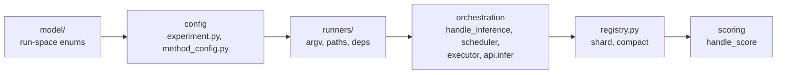
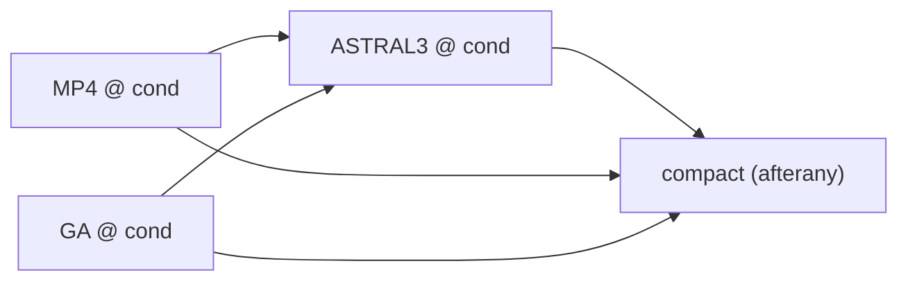

# Inference Architecture

Map of the config-driven pipeline (`scripts/lib/inference/` + `scripts/py/cli/`). Join keys: `KEYS.md`. Tables: `SCHEMAS.md`. Shell primitives: `SCRIPT_CONTRACTS.md`. CLI: `CLI.md`.

## Layers

Each layer depends only on those to its left.



| Layer | Files | Owns |
|---|---|---|
| model | `lib/model/` | `methods.py` (`TreeInferenceMethod`, `NetworkInferenceMethod`, `RunStatus`, `ConsensusMethod`), `strategies.py`, `guide_tree.py`. Nothing imports upward. |
| config | `lib/experiment.py`, `lib/inference/method_config.py` | YAML models (`MethodConfig`, one `*Config` per method), `METHOD_TO_CONFIG_CLASS`, `resolve_config`, `hash_config` (sha256 of the config JSON). |
| runners | `lib/inference/runners/` | One `Runner` subclass per method: argv, output paths, dependencies. |
| orchestration | `py/cli/handle_inference.py`, `lib/inference/{scheduler,executor,api}.py` | Order, resume, gate, fan-out. `api.infer` is the **only subprocess site**. |
| registry | `lib/inference/registry.py` | Shard-per-job JSONL, `compact` to CSV, manifest. |
| scoring | `py/cli/handle_score.py`, `lib/inference/scoring.py` | RF FN/FP vs the base tree (shells out to R). |

## Call tree: `pch experiment inference`

```
main.py: inference
├─ --executor slurm -> SlurmExecutor.fan_out(...)   # its jobs re-enter handle_inference
└─ handle_inference
   ├─ select_runners(config.methods)
   │  ├─ MethodConfig.get_enabled_configs()      # non-None fields
   │  ├─ cfg.get_runners()                       # config -> units of work
   │  └─ scheduler.sort_topologically(...)       # METHOD_TO_RUNNER_CLASS order breaks ties
   ├─ per dataset, per runner:
   │  ├─ resume: (method, hash_config) done?     -> skip
   │  ├─ gate: a dependency has no success?      -> block
   │  ├─ api.infer(input_csv, out_dir, runner)   -> InferenceResult
   │  └─ OK -> registry.write_result             -> shards/{job}.jsonl
   └─ registry.compact                           -> inference_registry.csv
```

## The runner contract

One abstract `Runner[ConfigT]` for tree and network methods (`runners/base.py`). A runner owns its `config`, so it owns its command and names.

| Member | Meaning |
|---|---|
| `method` | Its `InferenceMethod`; the scheduler keys on it. |
| `suffix` | Tells apart runs of one method on one dataset (`None` = bare stem). |
| `get_run_name(stem)` | `stem`, or `stem.suffix`. |
| `build_argv(...)` | The command `api.infer` runs. |
| `get_dependencies()` | Methods whose output it consumes. Methods, not runners: the gate is on method names. |
| `get_log_path` | Static. |
| `get_point_estimate_path` | Static. One tree, or `None` if the method has no single estimate. |
| `get_group_estimate_path` | Static. The set the estimate summarises (trees) or the family (networks); default `None`. |
| `get_consensus_method()` | How a set collapses to the point estimate; default `None`. |

Path getters are static so other code can look a method up without a runner, e.g. `METHOD_TO_RUNNER_CLASS[m].get_point_estimate_path(...)` (guide trees).

| Method | Point estimate | Group estimate |
|---|---|---|
| tree (`mp`, `ga`, `pch_*`) | tree file | tree set, if any |
| network (`camus`) | `None` (picking k is analysis) | `CAMUS/networks/<name>.csv`, one row per k |
| network (`phylonet_mpl`) | `None` (tree scoring skips networks) | `PHYLONET_MPL/networks/<name>.net`, one Rich newick |

### Fan-out

One config may yield several runners. `CamusConfig.get_runners()` returns one `CamusRunner` per guide, each with a single-guide config, its own `hash_config`, and output name `<stem>.<guide>`. `experiment status` counts each as `camus.<guide>`.

### Guide trees

A guide is a tree *method* or `true_tree`; there is no separate guide enum (`model/guide_tree.py`).

| Guide | Dependency |
|---|---|
| `pch_astral3`, `pch_wastral` | that method; CAMUS reads its point estimate |
| `true_tree` | none; the simulation base tree |

`mp`, `ga` and `pch_w_tree_qmc` are rejected at config load: CAMUS needs a rooted binary tree (`spec/camus/inference.md`). A guide names a method, not a config: `MethodConfig` holds one config per method.

## Scheduling (`scheduler.py`)

The registry holds **only successes**, so a row `(dataset_id, method, config_hash)` means done.

1. **Enabled**: `get_enabled_configs()`, in field order.
2. **Order**: `sort_topologically` puts a method after its enabled dependencies. Dependencies enabled elsewhere are ignored here; the gate covers them. Cycles raise.
3. Per `(dataset, runner)`, with `get_completed_runs` (registry plus uncompacted shards):

| State | Action |
|---|---|
| `(method, config_hash)` recorded | **skip** (resume) |
| a dependency has no success | **block**: log, no row |
| else | **run**; OK writes a row, failure logs only |

Blocked (never ran) differs from failed (ran, errored); neither is a row. With `--executor slurm`, `get_dependencies()` become `afterok` edges between per-(condition, method) jobs.

## SLURM (`executor.py`)



- One submitit job per (condition, method); condition = dataset parent dir.
- Batch jobs write shards only; the compact job alone merges and owns the manifest.
- Requeue on timeout (`slurm_max_num_timeout`) absorbs the 4 h cap; resume makes it safe.
- Two tiers: heavy (ASTRAL3), light (the rest). Node-local `PCH_SCRATCH`.
- Details: `specs/cli_specs/slurm_fanout_spec.md`, `OPERATIONAL_ISSUES.md`.

## Files written

`<experiment>/` is `experiment_folder:` from the YAML.

```
simulation_data/                       # handle_simulation
├─ model_graph_registry.csv            # base trees + networks
├─ config_registry.csv                 # sim configs
├─ simulated_data_registry.csv         # one row per dataset
├─ model_tree_<i>.txt, model_networks/ # copied bases
├─ configs/                            # per-condition sim configs
└─ simulated_data/<cond>/sim_<e>_<t>_<r>.csv
inference_data/
├─ inference_registry.csv              # registry.compact
├─ scores.csv                          # handle_score
├─ network_scores.csv                  # handle_network_score
├─ manifest.json                       # registry.init/finalize_manifest
├─ shards/{job}.jsonl                  # registry.write_result; removed by compact
├─ batches/<cond>.txt, spec.snapshot.*.yaml   # SlurmExecutor
└─ <cond>/<METHOD>/{trees,logs}/       # runner paths; CAMUS/{networks,logs}/
```

## Invariants

- **OK rule**: exit 0 **and** the point estimate exists; else, for a method with none, the group estimate exists.
- **Resume key** `(dataset_id, method, config_hash)`; `config_hash` is part of row identity.
- **Success-only ledger**: blocks and failures are logged, never rows. A row is analyzable data.
- **Dependency gate** is on method name, via the registry (this run or prior).
- `api.infer` never raises; failure is `status=failed`.
- A network row has an empty `point_estimate_newick` and a `group_estimate_path`; scoring skips empty newicks.
- `compact` is last-writer-wins by `ran_at`, seeds from the existing registry, deletes shards.
- Tree-method `config_hash` must not change across refactors; see `MIGRATIONS.md`.

## Seams: where to extend

| Add | Write |
|---|---|
| Tree method | Member in `TreeInferenceMethod` (`model/methods.py`); `*Config` + `MethodConfig` field (`experiment.py`); entry in `METHOD_TO_CONFIG_CLASS`; `runners/<m>.py` subclassing `Runner[<Config>]`; entry in `METHOD_TO_RUNNER_CLASS`. |
| Network method | Same, member in `NetworkInferenceMethod`; `get_point_estimate_path` returns `None`, set `get_group_estimate_path`. |
| Fan-out | Have the config's `get_runners()` return several runners; give each a distinct config and `suffix`. |
| Dependency | Override `get_dependencies()`; nothing else to order. |
| Guide tree | Add the method to `SUPPORTED_GUIDE_TREES` (`model/guide_tree.py`); it must emit a rooted binary tree. |
| Registry table | Schema in `py/cli/schemata.py`; writer reusing the `registry.py` shard/compact pattern; section in `SCHEMAS.md`. |

Also document the shell contract in `SCRIPT_CONTRACTS.md` and add tests mirroring `tests/scripts/lib/inference/`. Field-name tables and hand-ordering do not exist; order comes from `get_dependencies()`.

## Shell primitives

`api.infer` runs `scripts/sh/run{MP4,GA,ASTRAL3}.sh` (and `runCAMUS.sh`). Env: `$PCH_SCRATCH`, `$PCH_ASTRAL_XMX` (default `8g`). ASTRAL3's output folder name is single-sourced in `ASTRAL3Runner.VARIANT` and passed with `-V`.
