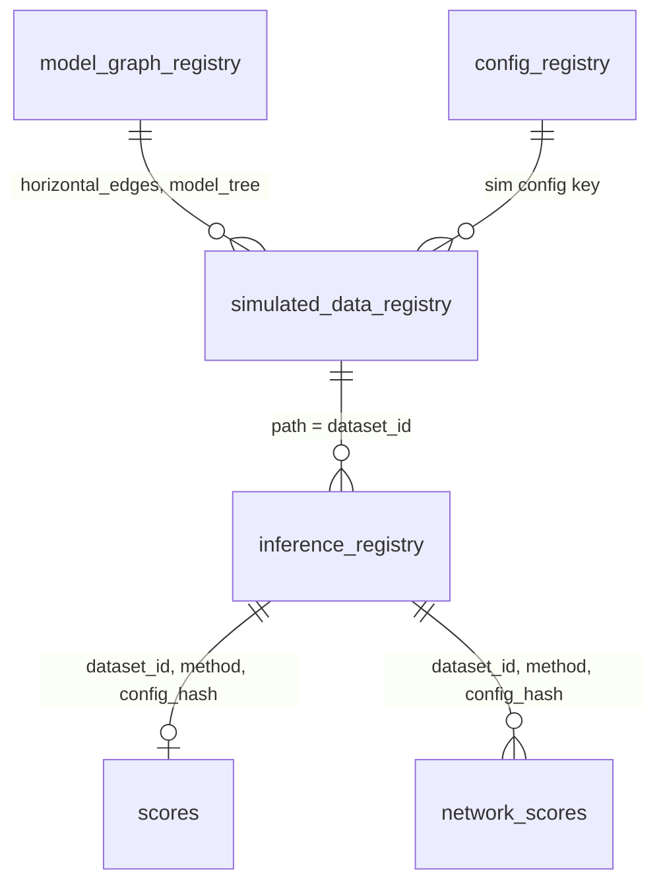

# Table Schemas

Source of truth: `scripts/py/cli/schemata.py`. If this file disagrees, the code wins. Join keys: `KEYS.md`. Changing a schema: add an entry to `MIGRATIONS.md`.

All paths are under `<experiment>/` (`experiment_folder:` in the YAML). All tables are plain CSVs read and written with the polars schema named below.

## `model_graph_registry`

`simulation_data/model_graph_registry.csv` · writer `handle_simulation` · `MODEL_GRAPH_REGISTRY` · key `(horizontal_edges, model_tree)`

Base trees (`horizontal_edges = 0`) and networks. `handle_score` reads the `0` row as the reference.

| Column | Type | Meaning |
|---|---|---|
| `horizontal_edges` | Int64 | Reticulation edges; `0` = tree. |
| `model_tree` | Int64 | Base tree number. |
| `path` | String | Copied model file. |
| `outgroup_label` | String | Grafted outgroup taxon; null when the experiment has none. |
| `outgroup_seed` | Int64 | Seed for the graft's lengths. |
| `outgroup_branch_length` | Float64 | Outgroup branch, U(0.9, 1.0). |
| `ingroup_stem_length` | Float64 | Ingroup stem, U(0.0, 0.1). |

## `config_registry`

`simulation_data/config_registry.csv` · writer `handle_simulation` · `CONFIG_REGISTRY_SCHEMA` · key `(poly_level, character_count, min_tree_height, homoplasy_factor, do_borrowing)`

| Column | Type | Meaning |
|---|---|---|
| `poly_level` | String | `verylow` to `veryhigh`. |
| `character_count` | Int64 | Characters simulated. |
| `min_tree_height` | Int64 | Minimum tree height. |
| `homoplasy_factor` | Float64 | Homoplasy. |
| `do_borrowing` | Boolean | Config used for networks. |
| `path` | String | Generated simulator config. |

## `simulated_data_registry`

`simulation_data/simulated_data_registry.csv` · writer `handle_simulation` · `SIMULATED_DATA_REGISTRY_SCHEMA` · key = the four config columns + `(horizontal_edges, model_tree, replica)`

One row per dataset CSV. Inference input.

| Column | Type | Meaning |
|---|---|---|
| `poly_level`, `character_count`, `min_tree_height`, `homoplasy_factor` | as in `config_registry` | Sim config key. |
| `horizontal_edges`, `model_tree` | Int64 | Model graph key. |
| `replica` | Int64 | Replicate number. |
| `path` | String | Dataset CSV. Becomes `dataset_id`. |

## `inference_registry`

`inference_data/inference_registry.csv` · writer `registry.compact` (rows from `registry.write_result` shards) · `INFERENCE_REGISTRY_SCHEMA` · key `(dataset_id, method, config_hash)`

One row per **successful** run; failures and blocks are never rows. Last-writer-wins by `ran_at`.

| Column | Type | Meaning |
|---|---|---|
| `dataset_id` | String | Canonical input CSV path (`registry.canonical_path`). |
| `method` | String | `InferenceMethod` value (`mp`, `pch_astral3`, `camus`, ...). |
| `config_hash` | String | sha256 of the method config JSON (`hash_config`). |
| `method_config_json` | String | The config that was hashed. |
| `runtime_seconds` | Float64 | Wall time. |
| `point_estimate_newick` | String | Tree, inline. Empty when the method has no point estimate (CAMUS). |
| `group_estimate_path` | String | The set or family file; null if none. CAMUS: the per-k CSV. SNaQ: one network (`.net`). |
| `consensus_method` | String | How the set collapsed to the point estimate; null if none. |
| `status` | String | Always `ok`. |
| `ran_at` | String | ISO8601 UTC. |
| `log_path` | String | Run log. |

Join to sim: `dataset_id == simulated_data_registry.path`.

## `scores`

`inference_data/scores.csv` · writer `handle_score` · `SCORES_SCHEMA` · key `(dataset_id, method, config_hash)`

RF error of each point estimate against the base tree. Rows with an empty `point_estimate_newick` are skipped.

| Column | Type | Meaning |
|---|---|---|
| `dataset_id` | String | As in `inference_registry`. |
| `method` | String | As in `inference_registry`. |
| `config_hash` | String | As in `inference_registry`. |
| `fn_rate` | Float64 | False-negative rate. |
| `fp_rate` | Float64 | False-positive rate. |

Join to the registry on the three key columns.

## `network_scores`

`inference_data/network_scores.csv` · writer `handle_network_score` · `NETWORK_SCORES_SCHEMA` · key `(dataset_id, method, config_hash, edges_added)`

PhyloNet `CmpNets -m cluster` of each network in a CAMUS run's family, or a SNaQ run's one network with lengths and γ stripped (its `group_estimate_path`), against the reference network. Existing keys are kept, failures and timeouts included, so a slow network is not retried each run.

| Column | Type | Meaning |
|---|---|---|
| `dataset_id` | String | As in `inference_registry`. |
| `method` | String | As in `inference_registry`. |
| `guide_tree` | String | From `method_config_json`; null for SNaQ; not part of the key. |
| `config_hash` | String | As in `inference_registry`. |
| `edges_added` | Int64 | Reticulation edges CAMUS added to the guide (its `Number of Branches`); SNaQ: its hybrid count. |
| `fn_rate` | Float64 | False-negative rate; null unless `ok`. |
| `fp_rate` | Float64 | False-positive rate; null unless `ok`. |
| `runtime_seconds` | Float64 | CmpNets wall time. |
| `status` | String | `ok`, `failed` or `timeout`. |
